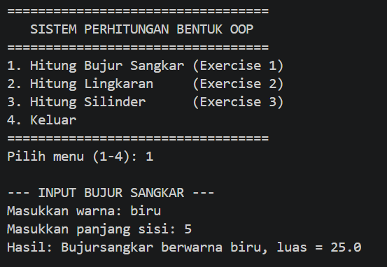
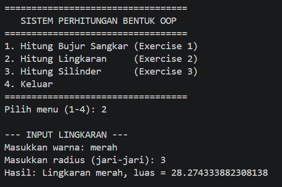
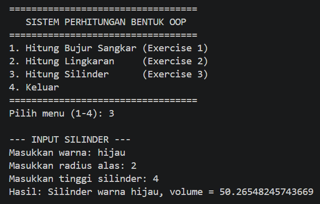
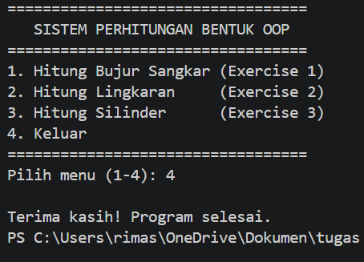

# Tugas Pemrograman Berorientasi Objek (PBO) - Exercise 1, 2, & 3

Repositori ini berisi implementasi program Java berbasis Pemrograman Berorientasi Objek (Object-Oriented Programming / OOP) untuk menyelesaikan Latihan (Exercise) 1, 2, dan 3. Program dilengkapi dengan sistem menu interaktif pada file `Main.java` menggunakan `java.util.Scanner`.

---

## 🛠️ Penerapan Konsep OOP (Object-Oriented Programming)

Program ini mengimplementasikan 4 pilar utama OOP serta kriteria teknis sesuai dengan materi perkuliahan:

### 1. Abstraction (Abstraksi)
Abstraksi diterapkan dengan memodelkan objek bentuk geometris dari dunia nyata menjadi kelas-kelas abstrak/representatif. 
* Class **`Bentuk`** mencakup atribut dasar seperti `warna` serta fungsi dasar `printInfo()` yang relevan untuk semua jenis bentuk tanpa perlu menyimpan detail spesifik kalkulasi pada kelas induknya.

### 2. Encapsulation (Enkapsulasi)
Enkapsulasi digunakan untuk melindungi data/variabel dalam kelas agar tidak dapat diakses atau diubah secara langsung dari luar kelas tanpa kontrol yang aman.
* **Access Modifier `private`**: Digunakan pada atribut spesifik seperti `sisi` (`BujurSangkar`), `radius` (`Lingkaran`), dan `tinggi` (`Silinder`).
* **Access Modifier `protected`**: Digunakan pada atribut `warna` pada class `Bentuk` dan `radius` pada `Lingkaran` agar dapat diakses secara langsung oleh kelas turunannya (*subclass*).
* **Getter & Setter**: Disediakan metode seperti `getSisi()`, `setSisi()`, `getRadius()`, dan `setTinggi()` untuk mengontrol pembacaan dan pembaruan atribut secara terisolasi.

### 3. Inheritance (Pewarisan)
Pewarisan digunakan untuk menggunakan kembali properti dan metode dari kelas induk (*reusability*) menggunakan kata kunci `extends` dan `super`:
* **`BujurSangkar extends Bentuk`**: Mewarisi properti `warna` dari kelas `Bentuk`.
* **`Lingkaran extends Bentuk`**: Mewarisi properti `warna` dari kelas `Bentuk`.
* **`Silinder extends Lingkaran`**: Merupakan turunan bertingkat (*multilevel inheritance*) yang mewarisi atribut `radius` dan `warna` dari `Lingkaran`.
* **Konstruktor `super()`**: Digunakan pada tiap *subclass* untuk memanggil konstruktor *superclass* pada baris pertama eksekusi.

### 4. Polymorphism (Polimorfisme)
Polimorfisme diterapkan melalui teknik **Method Overriding**:
* Method `printInfo()` yang awalnya didefinisikan pada class `Bentuk` di-*override* oleh class `BujurSangkar`, `Lingkaran`, dan `Silinder` untuk menampilkan format informasi dan kalkulasi hasil khas masing-masing kelas.
* Class `Silinder` memanfaatkan *reusability* dengan memanggil `hitungLuas()` dari parent-nya (`Lingkaran`) via `super.hitungLuas()` untuk menghitung volume (`luas alas * tinggi`).

---

## 📸 Screenshot Hasil Eksekusi Program

### 1. Menu Utama & Input Bujur Sangkar (Exercise 1)

### 2. Input Lingkaran (Exercise 2)

### 3. Input Silinder (Exercise 3)

### 4. Menu Keluar

---

## 👤 Pembuat
* **Nama**: [Tri Pilari Utama Sulan]
* **NIM**: [F1D02510094]
* **Kelas**: Pemrograman Berorientasi Objek (PBO)